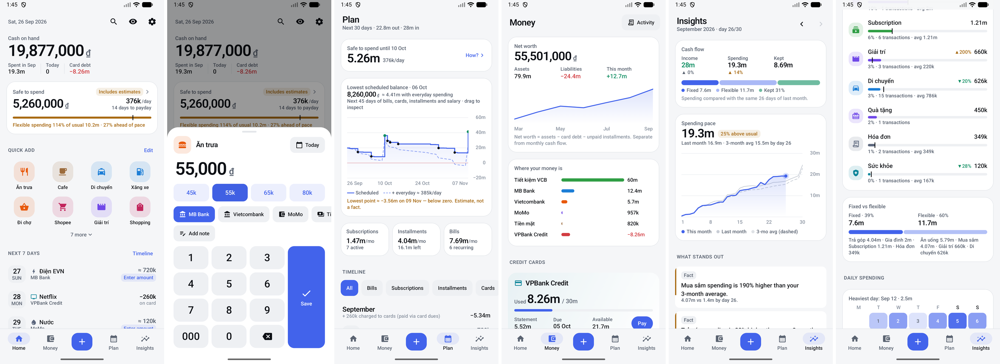
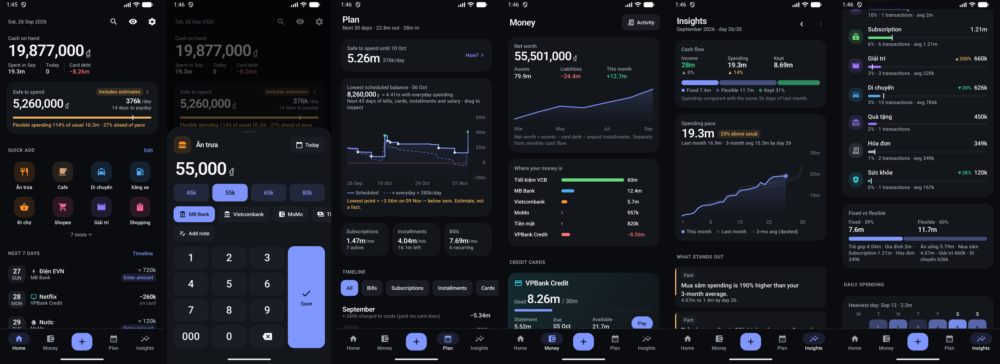

# Ledger

A personal, offline-first Android money app built around one interaction: **tap a preset → amount → save**.
Everything else — accounts, credit cards, subscriptions, installments, safe-to-spend, forecast and analytics —
exists to make the financial picture clearer without making that interaction slower.




- Product, IA, interaction model and design system: [docs/PRODUCT.md](docs/PRODUCT.md)
- Audit log (what was reviewed, found and fixed): [docs/AUDIT.md](docs/AUDIT.md)

## Build & run

Requirements: JDK 17+, Android SDK 36 (`local.properties` → `sdk.dir`).

```bash
./gradlew :app:testDebugUnitTest
```

```bash
./gradlew :app:installDebug
```

```bash
./gradlew :app:assembleRelease
```

The release build is minified (R8, ~2.6 MB) and signed with the debug key so it installs directly on your phone.
On first launch choose **Explore with demo data** to review every screen with a realistic 7-month dataset, or
**Get started** for the 4-step onboarding (currency → accounts → presets → optional pay day).

## Measured interaction counts (on device, demo data)

| Scenario | Path | Taps |
|---|---|---|
| A. 55k lunch, default bank | *Ăn trưa* → `55k` → Save | **3** (2 via long-press → `55k`) |
| B. 100k fuel | *Xăng xe* → `100k` → Save | **3** |
| C. Shopee on credit card | *Shopee* (card preselected) → amount → Save | **3** |
| D. 5m MB → VCB | **+** → Transfer → `5m` (learned route) → Save | **4** (or command `chuyển 5m mb vcb`) |
| E. Electricity from reminder | notification → amount (or `≈720k`) → Pay | **2–3** |
| F. Next month's mandatory payments | Plan tab → "October · Next month" header total | **1** |
| G. Safe to spend until salary | visible on Home at launch; tap for the formula | **0** / 1 |

## Architecture (deliberately small)

```
app/src/main/java/dev/personal/ledger/
  data/       Room entities + DAO, Repository (writes return Undo), Prefs, Seeds, DemoData
  domain/     Pure Kotlin: Ledger (balances, expense lines), Cards, Plan (recurrence, obligations,
              safe-to-spend, forecast), Analytics, Insights, Capture (preset ranking, command parser), Search
  ui/         Compose: theme tokens, components, charts (custom Canvas), home / entry / plan / money /
              insights / settings / onboarding
  backup/     JSON backup + CSV export (Storage Access Framework — the user picks the file)
  reminders/  WorkManager daily check: auto-post fixed auto-pay items, notify variable bills & card dues
```

* One module, no DI framework (`LedgerApp` wires Room + Repository), no backend, and no `INTERNET` permission —
  the app cannot reach the network.
* The whole ledger is held in memory as `LedgerData`; every calculation is a pure function over it, computed off
  the main thread. A personal ledger is thousands of rows, so this stays fast and makes every rule testable.
* All financial semantics live in `domain/Ledger.kt` (§8 of PRODUCT.md) and are covered by `LedgerTest`:
  transfers are zero-sum, card purchase + payment count once, refunds/reimbursements offset spending (never income),
  splits drive analytics, installments count per payment with the remainder as a liability, card-charged
  subscriptions are never double-counted in the forecast, safe-to-spend follows its published formula.

## Privacy

Local-only storage; no analytics, no accounts, no `INTERNET` permission. Optional app lock (biometric / device credential,
re-locks after 1 min away), hide-amounts mode, and screen protection (blocks screenshots and blurs the app in
Recents) — on by default for real data. Android cloud backup is disabled for the database; you own your data via
**Settings → Export backup / Export CSV / Restore**.
