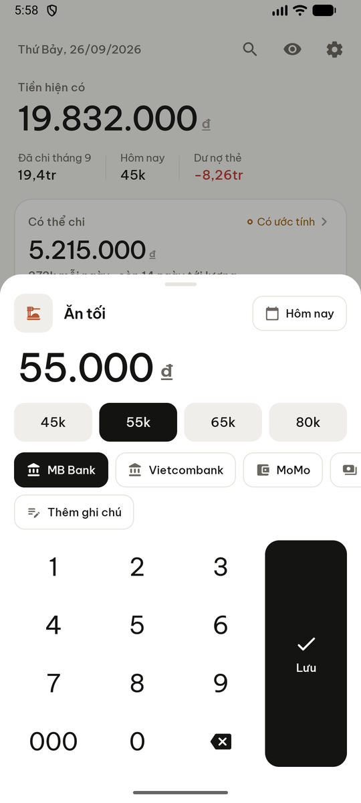
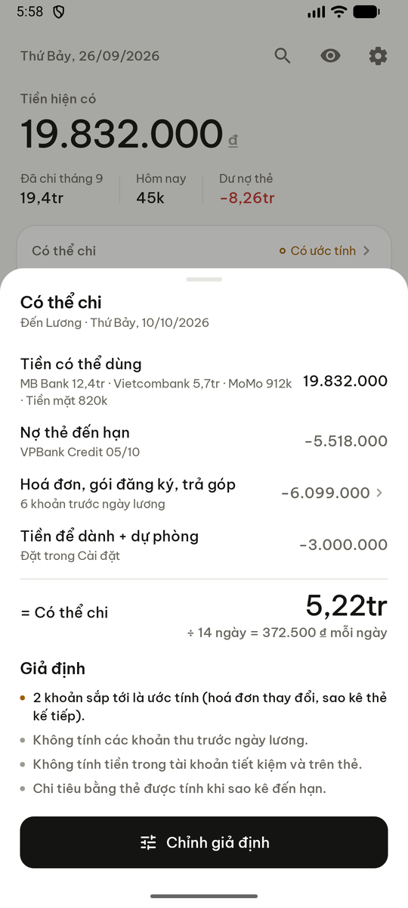
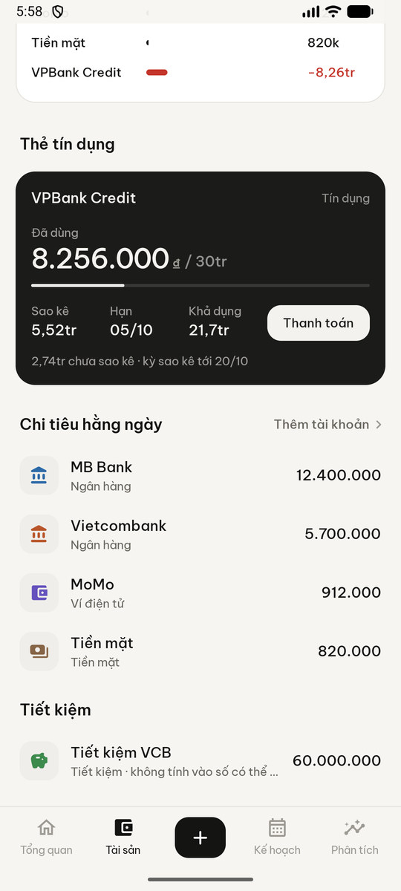
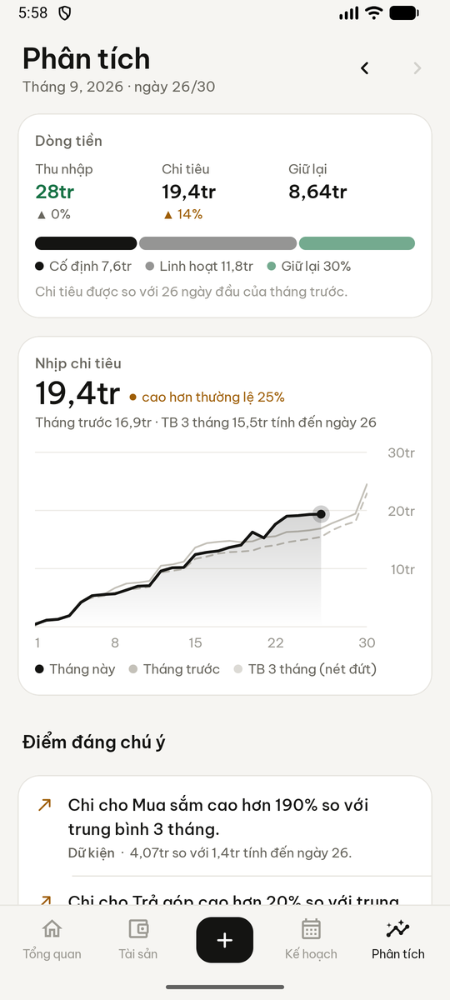

# Ledger

[](https://github.com/zcrossoverz/personal-finance/actions/workflows/android.yml)
[](https://github.com/zcrossoverz/personal-finance/releases/latest)

Ứng dụng quản lý tài chính cá nhân cho Android, chạy hoàn toàn trên máy (offline), xoay quanh một thao tác:
**chạm mục → nhập số tiền → lưu**. Mọi thứ còn lại — tài khoản, thẻ tín dụng, gói đăng ký, trả góp, số tiền
có thể chi, dự báo dòng tiền và phân tích — tồn tại để bức tranh tài chính rõ hơn mà không làm thao tác đó chậm đi.

*An offline-first personal finance app for Android. Vietnamese by default, English available in Settings.*


## Tải về

**[Tải APK mới nhất](https://github.com/zcrossoverz/personal-finance/releases/latest)** — mở link trên điện thoại,
tải file `ledger-…-release.apk` và cho phép cài từ nguồn không xác định khi Android hỏi.

Lần đầu mở app, chọn **Xem thử với dữ liệu mẫu** để xem mọi màn hình với 7 tháng dữ liệu thực tế, hoặc
**Bắt đầu** để thiết lập trong 4 bước (tiền tệ → tài khoản → mục nhập nhanh → ngày lương, có thể bỏ qua).

## Tính năng chính

| | |
|---|---|
| **Nhập nhanh** | Mục nhập nhanh (Ăn uống, Cafe, Xăng xe…) nhớ danh mục, tài khoản và số tiền hay dùng; nhấn giữ để lưu ngay một số tiền; tự đổi thành *Ăn trưa/Ăn tối* theo giờ; nhập bằng lệnh như `85k ăn`, `chuyển 5tr mb vcb` |
| **Tài sản** | Nhiều tài khoản (tiền mặt, ngân hàng, ví điện tử, tiết kiệm), thẻ tín dụng với sao kê, hạn thanh toán, hạn mức; tài sản ròng theo thời gian |
| **Kế hoạch** | Hoá đơn, gói đăng ký, trả góp và lương trên một lịch trình; **số tiền có thể chi** đến kỳ lương với công thức minh bạch; dự báo dòng tiền 45 ngày (phần ước tính luôn là nét đứt) |
| **Phân tích** | Dòng tiền tháng, nhịp chi so với tháng trước và trung bình 3 tháng, chi theo danh mục (xem chi tiết đến từng giao dịch), cố định/linh hoạt, lịch nhiệt, dòng chảy tiền, 6 tháng gần đây, nhận xét ghi rõ *dữ kiện / ước tính / dự báo* |
| **Chính xác** | Chuyển khoản không tính thu/chi; mua bằng thẻ chỉ tính một lần; hoàn tiền và tiền bạn bè trả lại bù vào chi tiêu, không tính là thu nhập; chia một giao dịch cho nhiều danh mục |
| **Riêng tư** | Chỉ lưu trên máy, không cần tài khoản, không có quyền truy cập Internet; khoá bằng vân tay/khuôn mặt; ẩn số tiền; chặn chụp màn hình; xuất/khôi phục JSON, xuất CSV |

| Nhập giao dịch | Có thể chi | Thẻ tín dụng | Phân tích |
|---|---|---|---|
|  |  |  |  |

## Số lần chạm cho các thao tác thường gặp (đo trên máy)

| Tình huống | Cách làm | Số lần chạm |
|---|---|---|
| Ăn trưa 55k, tài khoản mặc định | *Ăn trưa* → `55k` → Lưu | **3** (hoặc 2: nhấn giữ → `55k`) |
| Đổ xăng 100k | *Xăng xe* → `100k` → Lưu | **3** |
| Mua Shopee bằng thẻ tín dụng | *Shopee* (đã chọn sẵn thẻ) → số tiền → Lưu | **3** |
| Chuyển 5tr MB → VCB | **+** → Chuyển khoản → `5tr` → Lưu | **4** (hoặc lệnh `chuyển 5tr mb vcb`) |
| Nhập tiền điện từ thông báo nhắc | Chạm thông báo → số tiền → Thanh toán | **2–3** |
| Xem các khoản bắt buộc tháng sau | Tab Kế hoạch → nhóm "Tháng sau" có tổng | **1** |
| Còn chi được bao nhiêu đến kỳ lương | Hiện ngay ở Tổng quan; chạm để xem cách tính | **0** / 1 |

## Build

Cần JDK 17+ và Android SDK 36 (`local.properties` → `sdk.dir`).

```bash
./gradlew :app:testDebugUnitTest
```

```bash
./gradlew :app:installDebug
```

### CI và phát hành

GitHub Actions ([`android.yml`](.github/workflows/android.yml)) chạy test và build APK debug + release ở mọi lần
push và pull request (xem mục **Artifacts** của mỗi lần chạy). Để phát hành bản mới:

1. Tăng `versionCode` và `versionName` trong `app/build.gradle.kts`, commit và push.
2. Tạo tag — CI sẽ build, ký và đăng GitHub Release kèm APK:

```bash
git tag v1.0.1 && git push origin v1.0.1
```

Bản release được ký bằng keystore đọc từ biến môi trường `LEDGER_KEYSTORE_PATH`, `LEDGER_KEYSTORE_PASSWORD`,
`LEDGER_KEY_ALIAS`, `LEDGER_KEY_PASSWORD` (trên CI lấy từ repository secrets, keystore là `LEDGER_KEYSTORE_BASE64`).
Không có các biến này thì bản release dùng khoá debug để vẫn cài được. Keystore không bao giờ nằm trong repo.

## Kiến trúc

```
app/src/main/java/dev/personal/ledger/
  data/       Room entities + DAO, Repository (mọi thao tác ghi đều có Undo), cài đặt, dữ liệu mẫu
  domain/     Kotlin thuần: sổ cái, thẻ, lịch định kỳ, có thể chi, dự báo, phân tích, nhận xét, lệnh, tìm kiếm
  i18n/       tr() + bảng tiếng Việt (mặc định)
  ui/         Jetpack Compose: design system, biểu đồ vẽ bằng Canvas, các màn hình
  backup/     Sao lưu JSON + xuất CSV qua Storage Access Framework
  reminders/  WorkManager: tự ghi các khoản tự động, nhắc hoá đơn thay đổi và hạn thẻ
```

Một module, không DI framework, không backend. Toàn bộ quy tắc tài chính nằm trong `domain/` và được kiểm tra
bằng unit test (`LedgerTest`); `I18nTest` bảo đảm mọi chuỗi đều có bản tiếng Việt.

## Tài liệu

- [docs/PRODUCT.md](docs/PRODUCT.md) — định nghĩa sản phẩm, kiến trúc thông tin, mô hình tương tác, design system,
  quy tắc sổ cái
- [docs/AUDIT.md](docs/AUDIT.md) — nhật ký review: đã kiểm tra gì, phát hiện gì, sửa gì

Font [Be Vietnam Pro](https://github.com/bettergui/BeVietnamPro) được phân phối theo SIL Open Font License
([docs/licenses/BeVietnamPro-OFL.txt](docs/licenses/BeVietnamPro-OFL.txt)).
